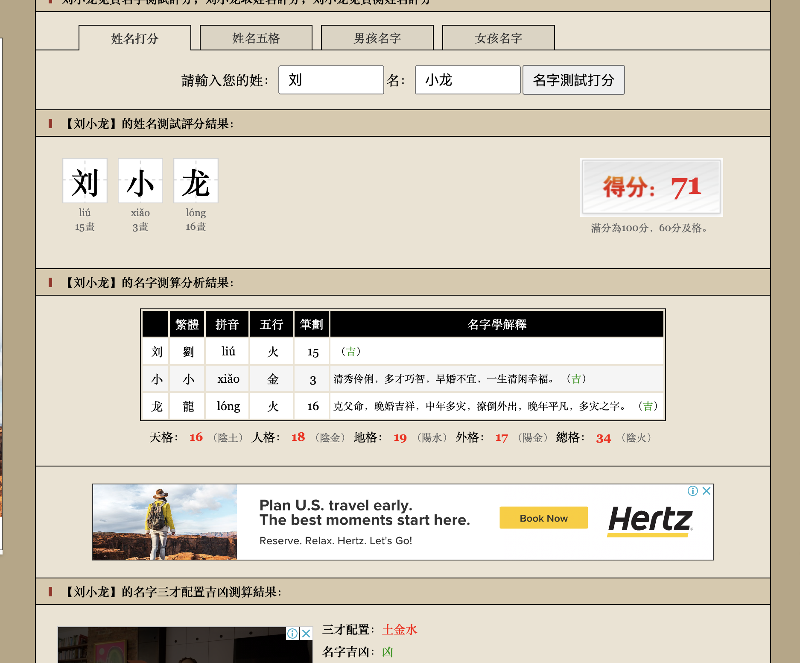
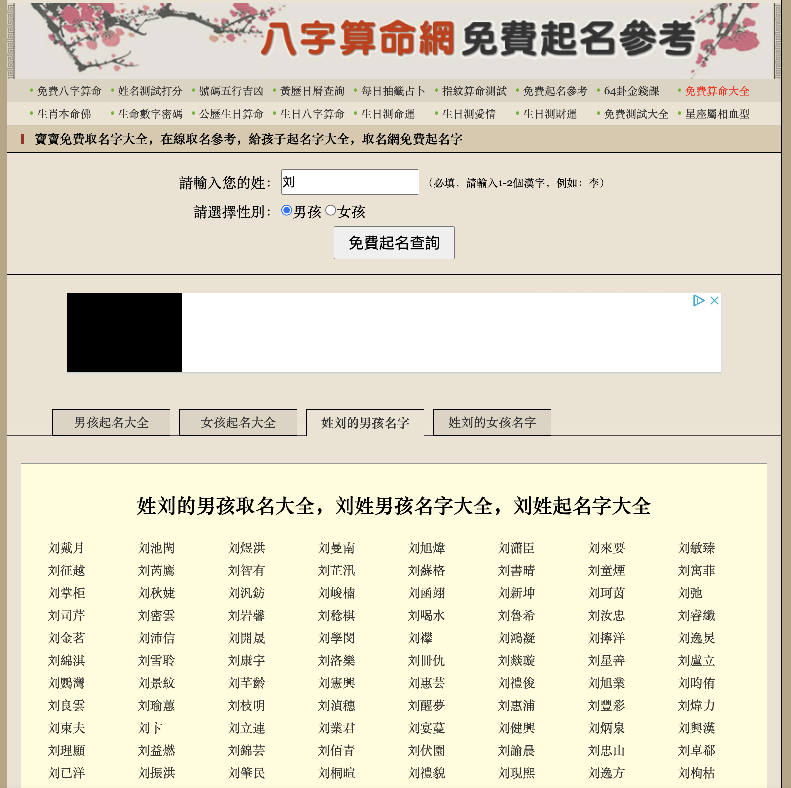
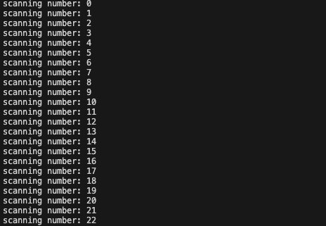
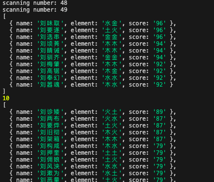

# Chinese_Name_BaZi_Bruteforce

This small snippet of code is used to bruteforce the best Chinese Name for your child, for their life-readings. Also to extract the elements needed to suit their 八字, results are based on a scoring system.

Scoring is ranked from top to low.
Scores that are >90 and <90 are placed separately on another array for easier filtering and readability

## Problems / Solution

#### Problems

It is too tedious to find a good name either my inputting a singular name into the input box 1-by-1, and then to check the score, it's hard to find a high scoring name, and also the required element.

The other way is to input the family surname, and then it will auto generate many names, but still, it's too tedious to click it one by one to check.

#### Solution

I used a chinese random name generator, to generate random chinese names.

And since there is no API provided to run through many options at once. I have to use the bruteforcing and web scaping method. To compile them one by one automatically.

User can decide on how many "runs" they would like to run by tweaking the:
"number_of_generation_time" variable, in the runScore.js file.
`const number_of_generation_time = 50;`

User can also change the Surname to suit them.
`const familySurname = "孙";`

## To Run

At the command prompt, in the javascript folder, run:

> node runScore.js

every run of a random name will be shown on screen, so users will know which stage it is running at the moment.

#### Results

Results will looks something like this:

Now, you will have a whole array of names, sorted from the best scoring, and also with your elemental that comes with it.

**Now take your pick!**

#### Also, credits to

- www.zhanbuwang.com ( for providing the name & BaZi lifereading analysis)
- the author of "chinese-random-name" package
- the author of "puppeteer" package
